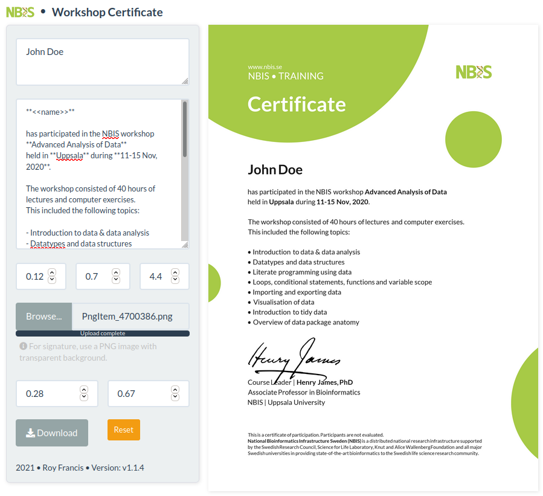

# shiny-certificate [](https://github.com/royfrancis/shiny-certificate/actions?workflow=docker-build)

This is an R shiny app to create certificates for NBIS workshops.



## Running the app

### Run online

Click [here](https://roymf.shinyapps.io/certificate/) to access an online instance of this app. This link may not always be active.

### Run using docker

```
docker pull docker.pkg.github.com/royfrancis/shiny-certificate/shiny-certificate:latest
```

### Run in R

Install the following R packages:

```
install.packages(c(Cairo, ggplot2, ggtext, png, shiny, shinythemes, shinyAce, showtext))
```

This repo is not an R package. In the root directory of this repo, run app using `shiny::runApp("app.R")`.

2020 | Roy Francis
